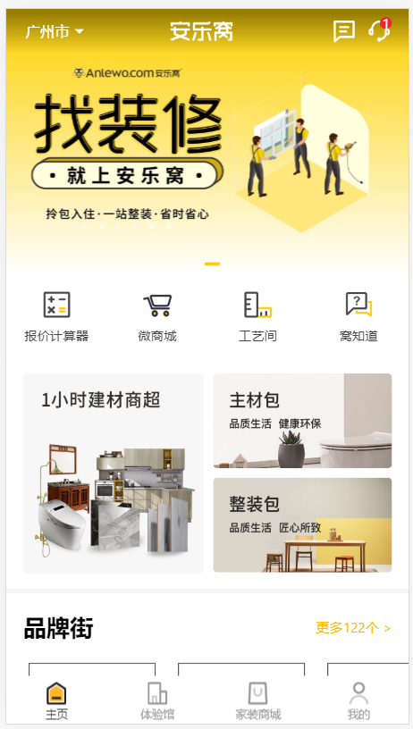
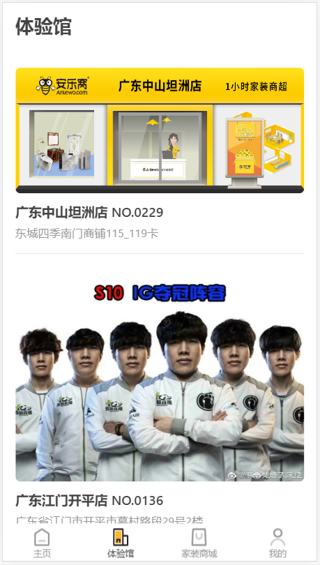
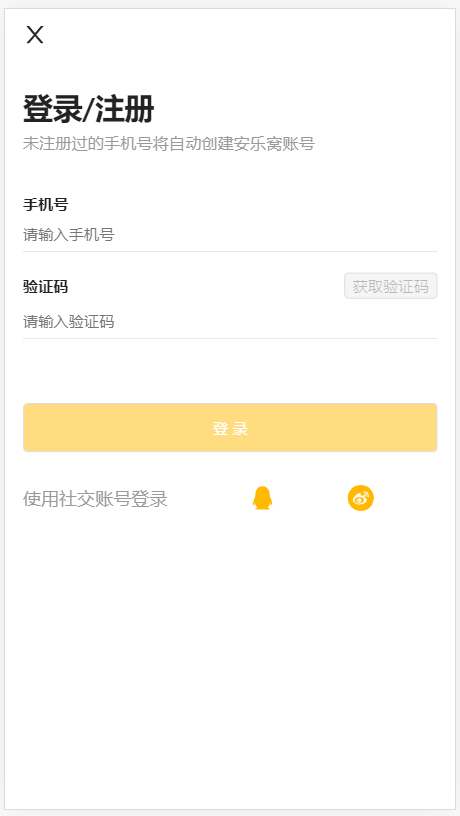
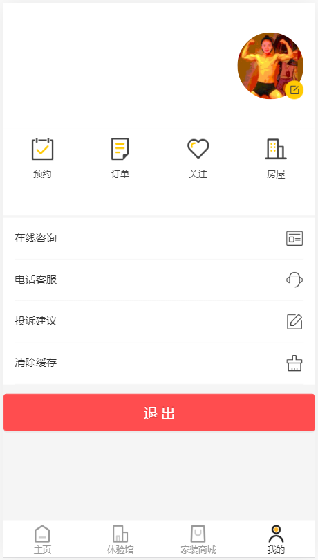
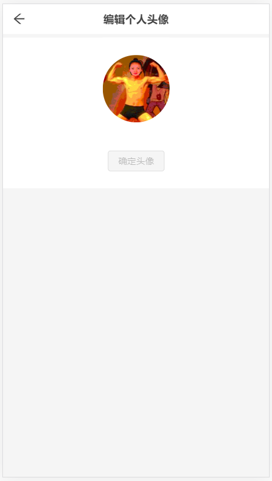
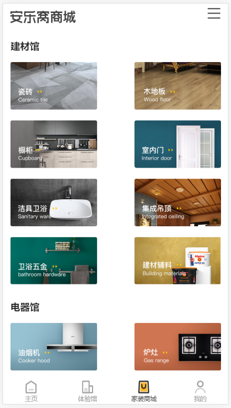
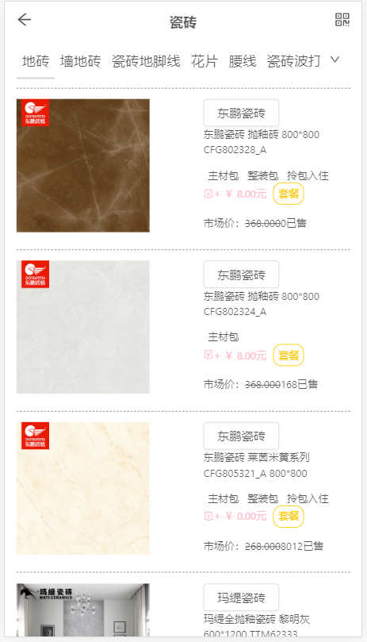
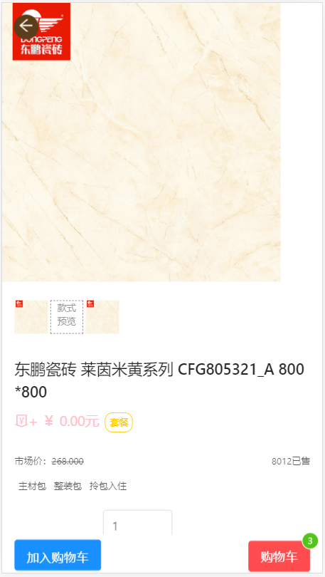
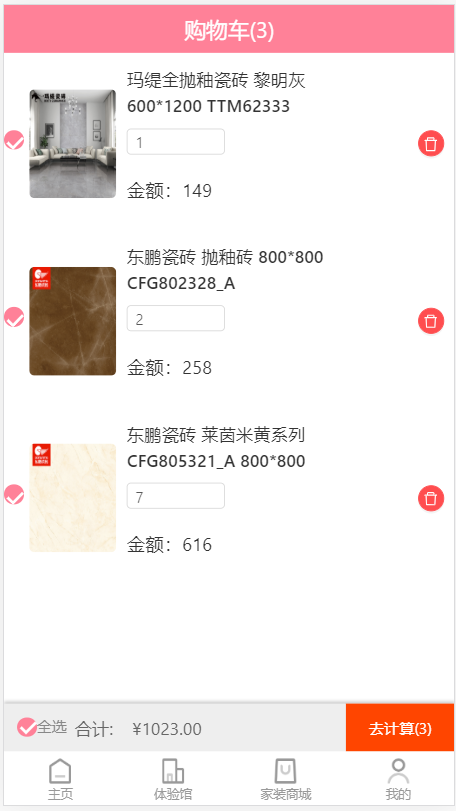

# 项目名称：安乐窝

项目介绍：安乐窝是一款基于react框架开发的关于建筑材料的线上商城，项目有配备后台管理系统。

### 项目演示：

- 官网地址：<https://m.anlewo.com/> 
- APP上线地址：<http://47.98.245.185:12345/> 
- 后台管理系统地址：<http://47.98.245.185:20202/> 

### 团队分工：

- 组长：钟国威、组员：沈显燕、夏玉龙

  > 团队项目环境由钟国威负责用webpack配置，页面自愿选择

#### 分工如下：

###### 钟国威：

- 服务器：负责用nodeJS里的express搭建后台服务器，并提供接口给组员
- 数据爬取：负责处理好网页的数据并存入到线上服务器中
- 首页：使用antd框架，并且根据传来的数据渲染，还还原了原网站的许多细节，以及封装了底部导航栏，根据react-router进行跳转
- 体验馆页：使用antd框架，并使用了img标签里面的一个onError事件，可以实现图片加载失败时的替换，还实现了页面的滚动懒加载功能
- 我的 / 登录 / 注册 / 替换头像:是用来antd框架，并模拟手机验证码实现了验证码注册和登录功能（注册和登录为一个页面），并且登录成功后会有token值存到本地localStorage 里面，登录成功后有默认头像，去到更换头像页，使用了antd的Upload组件实现了上传头像并更改的操作。
- 后台管理系统的添加商品功能：主要也是运用了antd的Upload组件结合Form组件实现，以及后端服务器是用来multer来存储传过来的图片。

###### 沈显燕：

- 一级列表页：使用antd框架，并结合后端传过来的数据渲染实现
- 二级列表页：使用antd框架编写结构，商品信息数据的接口，根据商品的标签进行筛选并且渲染商品
- 详情页：使用Ant-Design框架 ,react-router实现点击不同位置跳转到搜索页面，以及添加购物车
- 购物车页：使用redux以及react-redux和saga实现购物车的增删查改

###### 夏玉龙：

- 后台管理系统：
  - 使用antd框架写出结构，以及首页
  - 使用antd框架，登录页的实现以及根据token可以免登陆
  - 使用antd框架完成商品列表页，还实现了查与删除功能以及页面滚动懒加载功能，使用了img标签里面的一个onError事件，可以实现图片加载失败时的替换
  - 使用antd框架完成用户信息表，并实现了用户信息查与删

### 项目截图：

##### 首页：



##### 体验馆页(被403禁用的图片替换成了IG夺冠阵容)：



##### 我的：



##### 家装商城：



##### 详情页：



##### 购物车页：



### 项目目录：

```
F:.
│  .gitignore
│  package-lock.json
│  package.json
│  README.md
│  rem.js
│  webpack.config.js
│  yarn.lock
│
├─mongodata --- mongoDB备份
│
├─serve ---- nodeJS服务器
|
├─src --- 项目主要页面
│  │  App.js
│  │  main.js
│  │  template.html
│  │
│  ├─api
│  │      index.js
│  │
│  ├─pages
│  │  ├─Cart
│  │  │      cart.css
│  │  │      index.js
│  │  │
│  │  ├─Detail
│  │  │      detail.css
│  │  │      index.js
│  │  │      index2.js
│  │  │
│  │  ├─Home
│  │  │      Brand.css
│  │  │      Brand.js
│  │  │      index.css
│  │  │      index.js
│  │  │
│  │  ├─List
│  │  │      index.js
│  │  │      list.css
│  │  │
│  │  ├─Mall
│  │  │      index.js
│  │  │      mall.css
│  │  │      MallNav.js
│  │  │
│  │  ├─Mine
│  │  │      index.js
│  │  │      Info.js
│  │  │      Info.scss
│  │  │      Login.js
│  │  │      Login.scss
│  │  │      Mine.scss
│  │  │
│  │  ├─Nav
│  │  │      index.js
│  │  │      Nav.css
│  │  │
│  │  └─Tyg
│  │          index.js
│  │          Tyg.scss
│  │
│  └─store
│      │  index.js
│      │
│      ├─action
│      │      actionType.js
│      │      cartAction.js
│      │      index.js
│      │
│      ├─reducer
│      │      cart.js
│      │      index.js
│      │
│      └─saga
│              index.js
│
└─static ---- 图片
```

